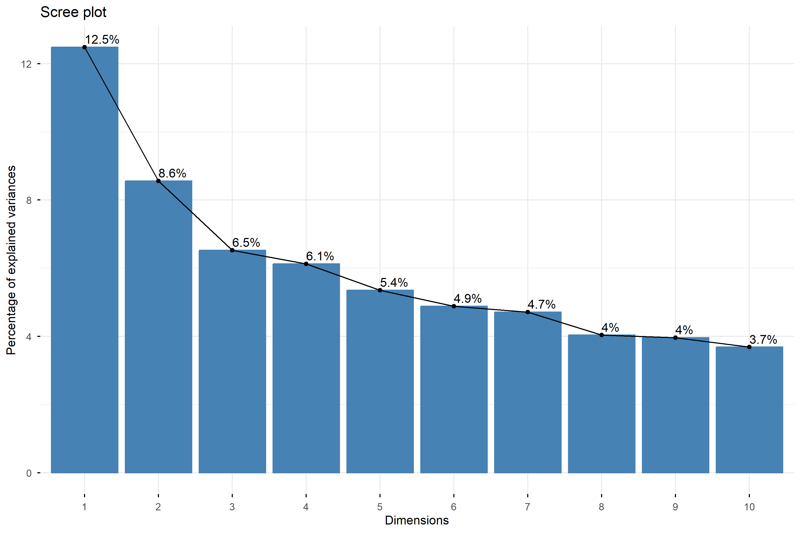
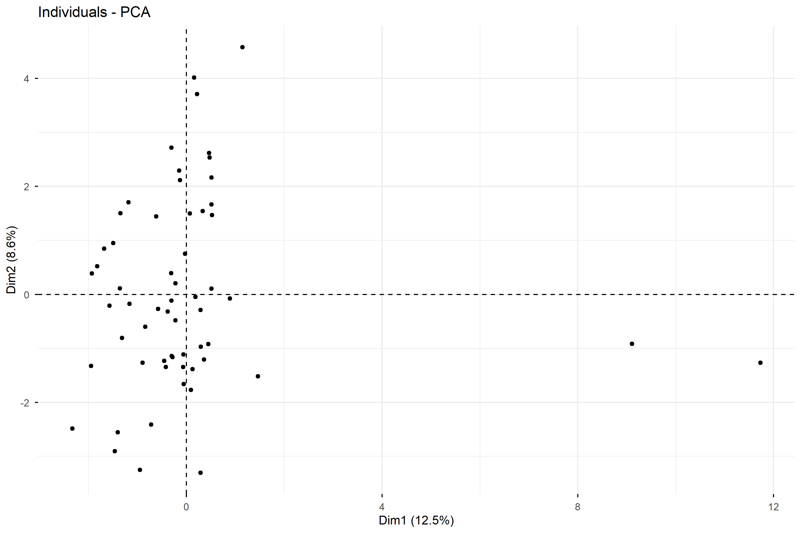
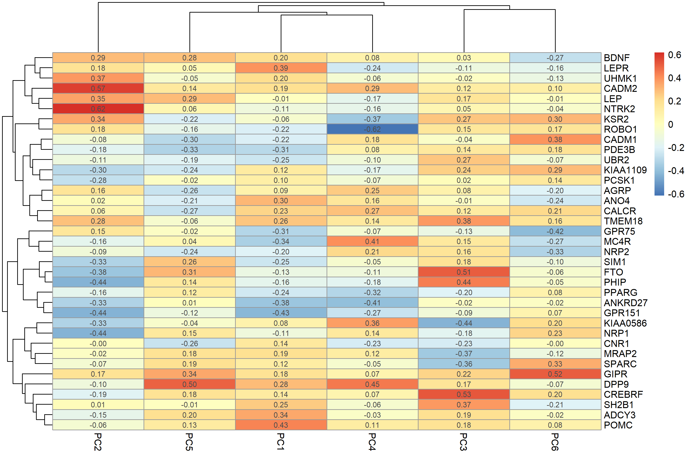

# Análisis de Expresión Génica Relacionada con Obesidad mediante PCA

Análisis de Componentes Principales (PCA), clustering, visualización mediante heatmaps, estadística descriptiva y regresión logística de datos de expresión génica asociados con obesidad utilizando R.

## Descripción del proyecto

Proyecto desarrollado para la asignatura **Estadística y R para Ciencias de la Salud** del **Máster en Bioinformática**.

El objetivo del estudio fue explorar patrones de expresión de 37 genes relacionados con obesidad en una cohorte de 59 individuos, empleando técnicas de reducción de dimensionalidad, análisis descriptivos y modelos predictivos.

## Objetivos

- Evaluar la normalidad de las variables génicas mediante el test de Shapiro-Wilk.
- Realizar un Análisis de Componentes Principales (PCA).
- Explorar patrones de agrupamiento entre individuos y genes.
- Construir heatmaps de correlaciones entre genes y componentes principales.
- Comparar la expresión génica mediante tablas descriptivas estratificadas por terciles.
- Evaluar asociaciones con sobrepeso mediante regresión logística ajustada.

## Herramientas utilizadas

- R
- RMarkdown
- stats
- factoextra
- pheatmap
- gtsummary
- broom
- dplyr

## Principales resultados

- Los 37 genes analizados rechazaron la hipótesis de normalidad.
- Las seis primeras componentes principales explicaron aproximadamente el 43.9 % de la variabilidad total.
- Se identificaron patrones de correlación entre genes relacionados con la regulación energética y las componentes principales.
- No se encontraron asociaciones estadísticamente significativas entre los terciles de las componentes principales y el sobrepeso.
- La edad fue el único predictor significativo en el modelo de regresión logística ajustado.

## Figuras principales

### Figura 1. Scree plot del PCA

Las seis primeras componentes principales explicaron aproximadamente el 43.9 % de la variabilidad total.



### Figura 2. Distribución de individuos en el PCA

La mayoría de los individuos se agrupó alrededor del origen, aunque algunos pacientes mostraron separación respecto al grupo principal.



### Figura 3. Heatmap de correlaciones

Heatmap de correlaciones de Spearman entre los genes analizados y las seis primeras componentes principales.



## Estructura del repositorio

```text
bioinformatics-gene-expression-pca/

README.md
Act3_grp_RStudio.Rmd
Act3_grp_RStudio.html

figures/
├── Figura1_ScreePlot.png
├── Figura2_PCA_Individuos.png
└── Figura3_Heatmap.png

Poster/
├── Poster_Actividad3.pptx
└── Poster_Actividad3.pdf
```

## Autores

- Luis Angelo Cruz
- Luis Ignacio Figueroa Gomez
- Maria Alejandra Ardila Jimenez

Máster en Bioinformática  
Universidad Internacional de La Rioja (UNIR)

## Licencia

Este repositorio tiene fines exclusivamente académicos y educativos.